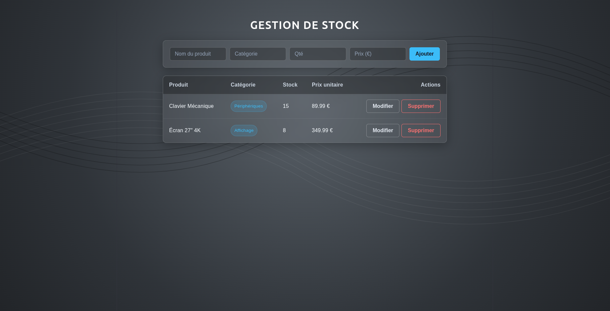

Interface Web Dynamique de Gestion de Stock

Application web de gestion d'inventaire en temps réel développée avec React, Vite et Supabase

Technologies
- React.js
- JavaScript (ES6+)
- CSS3
- Vite
-Supabase (PostgreSQL & Row Level Security)

Fonctionnalités
- Consultation de la liste des produits
- Ajout de nouveaux produits via un formulaire réactif
- Modification directe des éléments du tableau
- Suppression de produits
- Style personnalisé avec effet glassmorphism et fond 
-Persistance des données via base de données PostgreSQL (Supabase)
-Sécurisation des accès avec règles RLS

Interface Utilisateur

Installation et Lancement

1. Cloner le projet :
git clone https://github.com/DevByNicolas/gestion-stock-react.git

2. Accéder au dossier :
cd gestion-stock-react

3. Installer les dépendances :
npm install

4. Configurer l'environnement :
Créer un fichier .env.local à la racine avec :
VITE_SUPABASE_URL=votre_url_supabase
VITE_SUPABASE_ANON_KEY=votre_cle_anon_supabase

5. Lancer le serveur local :
npm run dev